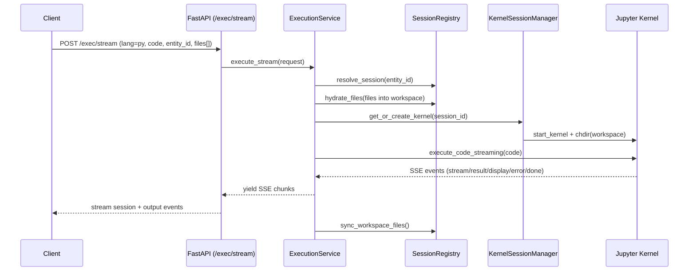
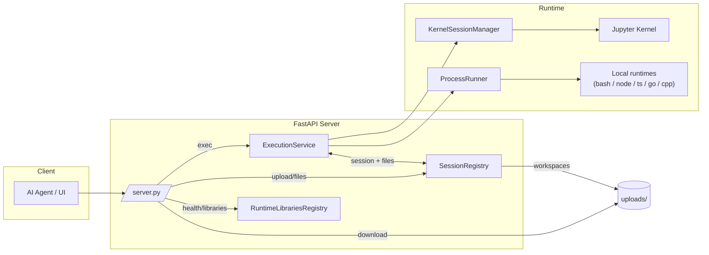

# MCP Code Interpreter Architecture

This document explains how the MCP Code Interpreter is put together: the key components, how requests flow, how execution is isolated, and what deployers need to know to run it in production.

## Goals and Design Principles
- Provide a production-ready MCP-compatible execution surface for AI agents (LibreChat, Claude Desktop, custom clients).
- Keep Python executions stateful (Jupyter kernel per session) while running other languages in isolated subprocesses.
- Support file uploads/downloads bound to a session workspace.
- Prefer streaming feedback for Python while buffering other runtimes.
- Remain easy to run locally (uv + FastAPI) and in containers (Dockerfile + docker-compose).

## High-Level Topology
- FastAPI app (`src/mcp_code_interpreter/server.py`) exposes REST endpoints (`/exec`, `/exec/stream`, `/upload`, `/files`, `/download`, `/health`, `/libraries`).
- ExecutionService (`src/mcp_code_interpreter/execution_service.py`) routes work to:
  - Jupyter KernelSessionManager for Python.
  - ProcessRunner for Bash/Node/TypeScript/Go/C++.
- SessionRegistry tracks session affinity (entity → session), workspaces, and files under `uploads/`.
- Runtime capability + library inventory helpers (`src/mcp_code_interpreter/capabilities/`) inform health and tooling discovery.

Simplified flow:
1. Client sends `/exec` or `/exec/stream` with `lang`, `code`, optional `entity_id`, and optional file refs.
2. SessionRegistry resolves/creates a session and workspace; files are materialized into that workspace.
3. Python → KernelSessionManager executes via Jupyter; non-Python → ProcessRunner executes a subprocess.
4. Outputs plus session file summaries are returned; new workspace files are registered.

## Mermaid Diagrams

### Python Streaming Execution (/exec/stream)

### Component Overview

## Core Components

### FastAPI Server (`src/mcp_code_interpreter/server.py`)
- Wires configuration from env vars (`MAX_SESSIONS`, `EXECUTION_TIMEOUT`, `UPLOADS_DIR`, `BASH_STRICT_MODE`, `CODE_INTERPRETER_API_KEY`, etc.).
- Applies CORS rules and optional request logging (`LOG_REQUESTS`).
- Enforces optional API key via `x-api-key`.
- Endpoints:
  - `/exec` (buffered execution) and `/exec/stream` (SSE for Python) backed by ExecutionService.
  - `/upload` to persist files into a session workspace.
  - `/files/{session_id}`, `/files/{session_id}/{file_id}` (list/delete), `/download/{session_id}/{file_id}` (raw download).
  - `/health` (runtime availability + library snapshot) and `/libraries` (runtime-specific inventories).
- Lifespan hook shuts down any running kernels on exit.

### Session Registry (`src/mcp_code_interpreter/session_registry.py`)
- Creates and resolves sessions keyed by `session_id` with optional `entity_id` affinity so repeated calls reuse the same workspace and Python kernel.
- Persists per-session workspaces under `UPLOADS_DIR/<session_id>`.
- Tracks file metadata (`FileRecord`) and exposes CRUD + summaries compatible with LibreChat schemas.
- Registers workspace-created files after executions (`sync_workspace_files`).
- Provides concurrency safety with an `RLock`.

### Kernel Session Manager (`src/mcp_code_interpreter/kernel_manager.py`)
- Manages Jupyter kernels per session (default `python3` or configured aliases).
- Initializes kernels with working directory set to the session workspace and ensures it is on `sys.path`.
- Enforces a soft cap on kernel instances (`MAX_SESSIONS`); evicts/shuts down the oldest kernel when exceeded.

### Execution Service (`src/mcp_code_interpreter/execution_service.py`)
- Shared execution surface returning LibreChat-style responses.
- Resolves session affinity, hydrates referenced files into the workspace, and dispatches to Python or subprocess paths.
- Python path:
  - Uses KernelSessionManager + `utils.execute_code_jupyter` to run code in-kernel.
  - Formats outputs and errors into the `run` structure; supports SSE streaming via `execute_code_streaming`.
- Non-Python path:
  - Delegates to ProcessRunner, then syncs workspace files and formats a consistent payload.

### Process Runner (`src/mcp_code_interpreter/process_runner.py`)
- Executes Bash/Node/TypeScript/Go/C++ snippets inside the session workspace.
- Writes code to a temp file, builds a runtime-specific command, and executes with a sanitized environment (HOME → workspace, trimmed env allowlist).
- Supports optional strict bash prelude (`set -euo pipefail`), RLIMIT-based CPU/memory caps, and per-call args.
- For C++, compiles then runs a temporary binary; cleans up artifacts after execution.
- Enforces runtime availability based on discovered capabilities; returns 503 when unavailable.

### Runtime Capability + Library Inventory (`src/mcp_code_interpreter/capabilities/`)
- `discover_runtime_capabilities()` checks required binaries per runtime to report availability in `/health`.
- `RuntimeLibrariesRegistry` inspects installed/declared packages for Python and tool versions for other runtimes; results power `/libraries` and `/health` metadata.

### Utilities (`src/mcp_code_interpreter/utils.py`)
- Jupyter execution helpers that collect iopub messages, format outputs (streams, execute_result, display_data, errors), and provide SSE-friendly streaming.

## Data and Storage Layout
- `UPLOADS_DIR` (default `uploads/`): session-scoped workspaces; holds uploaded files, execution artifacts, compiled binaries (temporary), and any user-created outputs.
- `NOTEBOOKS_DIR` (default `notebooks/`): persistent notebook storage (currently unused by core flows but reserved for future features).
- `logs/`: host-mounted by Docker Compose for server logs.
- Session + file identifiers are random, URL-safe IDs to avoid collisions and allow cheap lookups.

## Request Flows

### Upload Flow
1. Client POSTs multipart to `/upload` with optional `entity_id`.
2. SessionRegistry resolves/creates a session and streams each file to `UPLOADS_DIR/<session_id>/mnt/data/<filename>` for `/mnt/data` compatibility.
3. Response returns LibreChat-compatible file objects (`message: "success"`, `fileId`/`filename`) and the `session_id`.

### Python Execution (buffered `/exec`)
1. ExecutionService resolves session via `entity_id` and/or `session_id` (or creates one) and hydrates referenced files.
2. KernelSessionManager returns the per-session Jupyter kernel; code is prefixed with args comment when provided.
3. `execute_code_jupyter` runs code, collects outputs/errors, and ExecutionService formats the LibreChat payload.
4. Workspace files are synced back into SessionRegistry and included in the response.

### Python Execution (streaming `/exec/stream`)
1. Same session resolution + file hydration as buffered path.
2. SSE stream starts with a `session` event; subsequent events include `stream`, `result`, `display`, `error`, and final `done`.
3. After completion, new workspace files are registered.

### Non-Python Execution
1. Session resolved; files hydrated.
2. ProcessRunner writes code to a temp file, builds the runtime command, and executes within the workspace.
3. Output is buffered; upon completion, workspace files are synced and the response mirrors the LibreChat shape.

## Runtime Strategy: Kernels vs. Subprocesses
- Default: Python runs inside a persistent Jupyter kernel; all other runtimes (bash, node, ts, go, cpp) run as short-lived subprocesses in the session workspace.
- Why subprocess for non-Python:
  - Smaller footprint and faster cold start than adding multiple Jupyter kernels (xeus-cling, bash kernels, go kernels).
  - Simpler security: native code is short-lived, honors RLIMIT caps, and inherits a trimmed environment with HOME pinned to the workspace.
  - Operational consistency: same model across non-Python languages; predictable cleanup and no long-lived native kernels to evict.
- Revisit path: If users need stateful non-Python sessions, we can add optional kernels (e.g., C++/cling, bash kernel, Go kernel) behind a config flag with capability detection, keeping the subprocess path as the fallback.

## Security and Isolation Model
- Container-first: Dockerfile runs as non-root with configurable `APP_UID/GID`; docker-compose further drops capabilities and can run with `no-new-privileges`.
- Workspace isolation: each session has its own directory, used as HOME for subprocesses and kernel cwd, limiting cross-session leakage.
- Environment trimming: subprocesses inherit only an allowlist of env vars; `PYTHONPATH` cleared.
- Bash guard: optional `set -euo pipefail` reduces silent failures for shell scripts.
- Resource limits: optional RLIMIT_AS (memory) and RLIMIT_CPU applied to subprocesses when configured.
- Timeouts: `EXECUTION_TIMEOUT` bounds Jupyter waits and subprocess execution.
- API auth: optional `CODE_INTERPRETER_API_KEY` required on all endpoints when set.

## Observability and Operations
- `/health` returns server status, active/cleaned kernel counts, runtime capabilities, and library inventory snapshot.
- `/libraries` exposes per-runtime package/tooling information (used by clients to decide available tooling).
- Request logging (without body dumps of large payloads) can be enabled via `LOG_REQUESTS=true`.
- Kernel cleanup: `cleanup_dead_sessions()` runs on `/health`; lifespan hook shuts down kernels on process exit.

## Deployment and Runtime
- Local dev: `make install && make dev` (uv + FastAPI with auto-reload).
- Tests: `make test` for unit suite; `bash e2e/run_all.sh` hits a running server to verify runtimes end-to-end.
- Containers: `docker-compose.yml` builds/starts the service with bind-mounted `notebooks/`, `uploads/`, and `logs/`; supports joining an existing network (`MCP_NETWORK_EXTERNAL`, `MCP_NETWORK_NAME`).
- OpenAPI: `make openapi` regenerates `openapi.json` for MCP/LibreChat import.

## Extensibility Notes
- Adding a new runtime:
  - Update `SUPPORTED_LANG_CODES` in `server.py`.
  - Extend `ProcessRunner.run()` with a new branch + command builder and add binaries to `capabilities.REQUIRED_BINARIES`.
  - Optionally enhance `RuntimeLibrariesRegistry` to report tooling/package info.
- Session policies (eviction, quotas) are centralized in KernelSessionManager (kernel count) and SessionRegistry (workspaces); adjust there for tighter controls.
